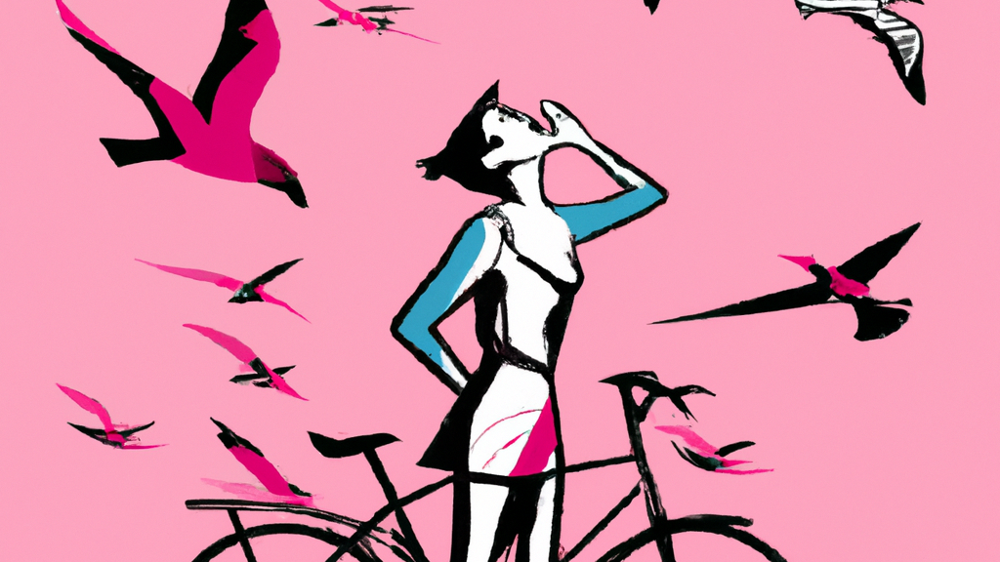

Hi there ✋!

I'm Ana-Marija.

## About me

I am a front-end developer who embarked on my coding journey in 2020 through the  platform. Currently, I am employed as a front-end developer and actively engaged in personal projects to continuously enhance my skills and knowledge.

## My experience

### Programming languages used in my projects:

    
    
    
    

### Frameworks and Libraries I used:

    
    
    

### Tools I use:

    
    
    
    
    
    

## My projects

Accommodation webpage | Quiz game
------------ | ------------
 | 
HTML5, CSS3, JavaScript | HTML5, CSS3, React, API
[📖 Github repo](https://github.com/anamarijadraskovic/katarica_apartmani_draft) | [📖 Github repo](https://github.com/anamarijadraskovic/quizz)

## Contact me:
 

### PS: What's with the header? 🤔
I made it using AI to represent me with my hobbies, cycling and watching birds 😊
